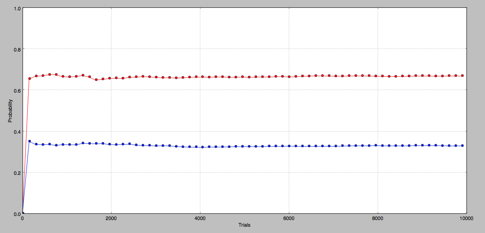

Intro to MVC Architecture
===========================

* Controller contains business logic. It drives the program
* Helper assists the controller
* View is simple & in this case used to display a graph

* Start the program by running ` python start.py`

Monty-Hall Problem Results for 10000 Trials:

Run Unit Tests:
python -m unittest discover test

